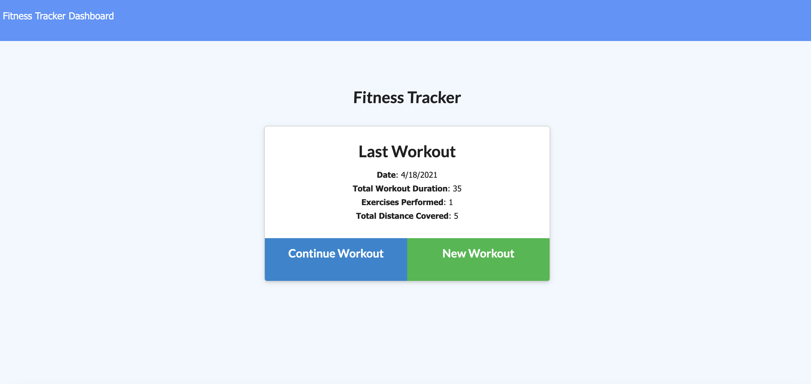
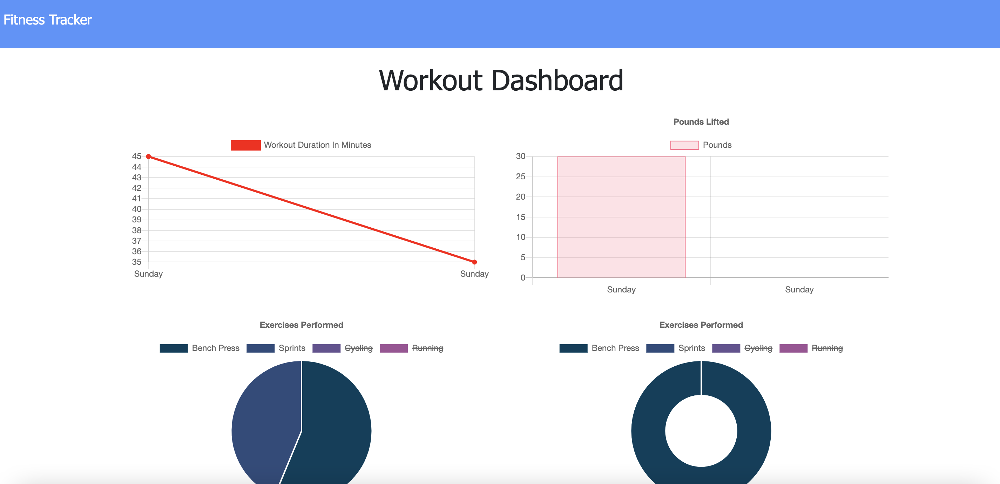

# Fitness-Tracker

---------------

## *Table of Contents*
- [Description](#description)
- [Installation](#installation)
- [Contributing](#contributing)
- [Author](#author)

---------------

## *Description*
This application is designed to help a user view, create and track their workouts. With the application, the user is able to log multiple exercises in a workout on a given day. The exercises can be tracked by name, type, weight, sets, reps and duration. If the exercise is cardio then the distanced can be tracked. When looking at the application dashboard, the user is able to see their workouts in one place and track their progress.

---------------

## *Installation*
npm install

---------------

## *Contributing*
Please use a new branch before contributing

---------------

## *Author*
- Hanna Munoz
- [Github](https://github.com/hannamunoz)
- [LinkedIn](https://www.linkedin.com/in/hanna-munoz-179993b2/)

---------------

This project is MIT licensed